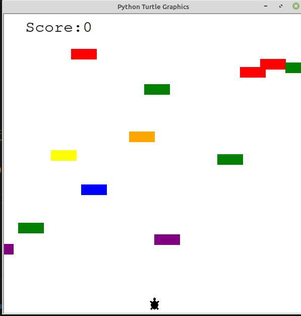

# Day23

## CAPSTONE!

## steps taken to create the game:

- Create turtle class
- Add a method to move the turtle 
- Add eventlistners to control the turtle's movements
- Detect collision with the top part of the screen and increment the score

- Creat a Car_manager class

- Add a methods to randomly position cars on screen and move them 

- Detect collision with the cars
- Create a scoreboard class to keep track of the scores.
- Detect collision with top part of screen and update the scoreboard


## Project to solidify material learned 

### turtle_crossing_game:

> This is a game created with the tutle python library. The goal is to cross to the other side of the screen without been hit by the moving cars more like moving squares. 😂

#### Preview:




## How to run this on your device

- Clone this repository
```
git clone https://github.com/kingdreamerr/Day23_Turtle_Crossing_Game.git
```
- cd into the repo
```
cd Day23_Turtle_Crossing_Game
```

- Paste the following in the terminal 
```
python3 main.py
```
